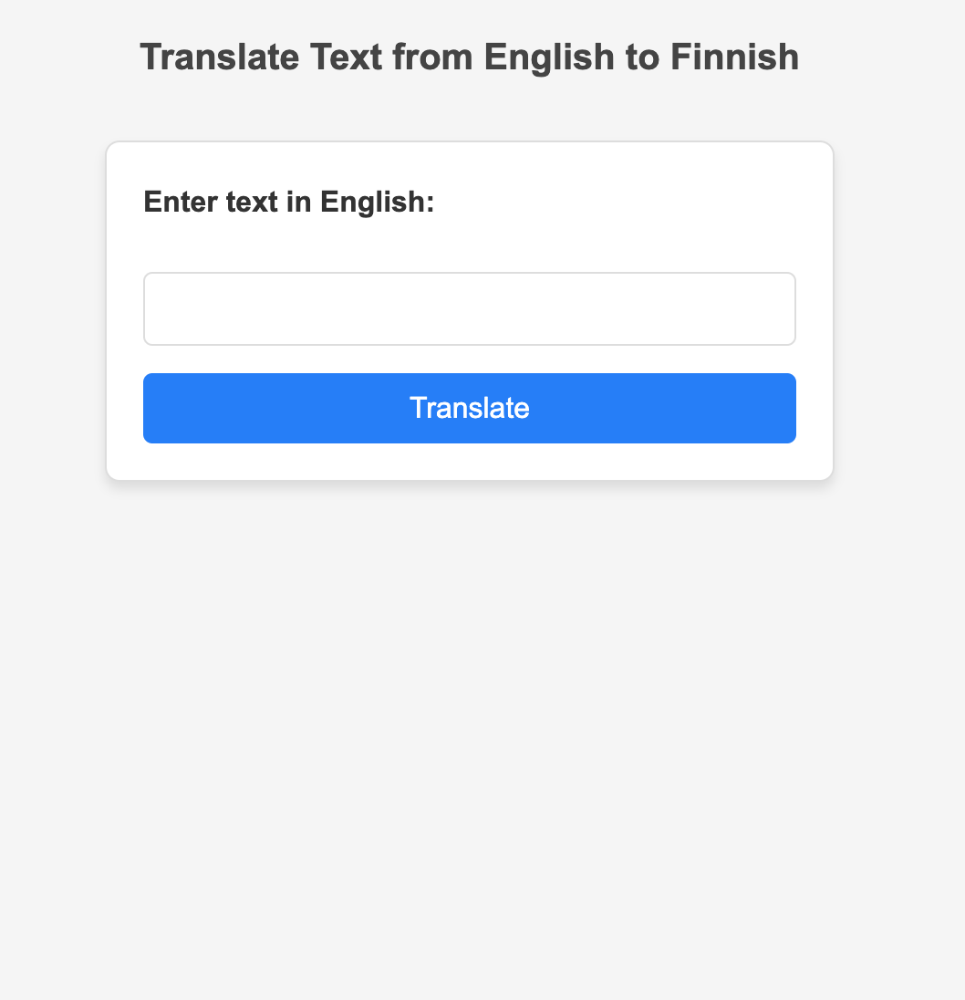
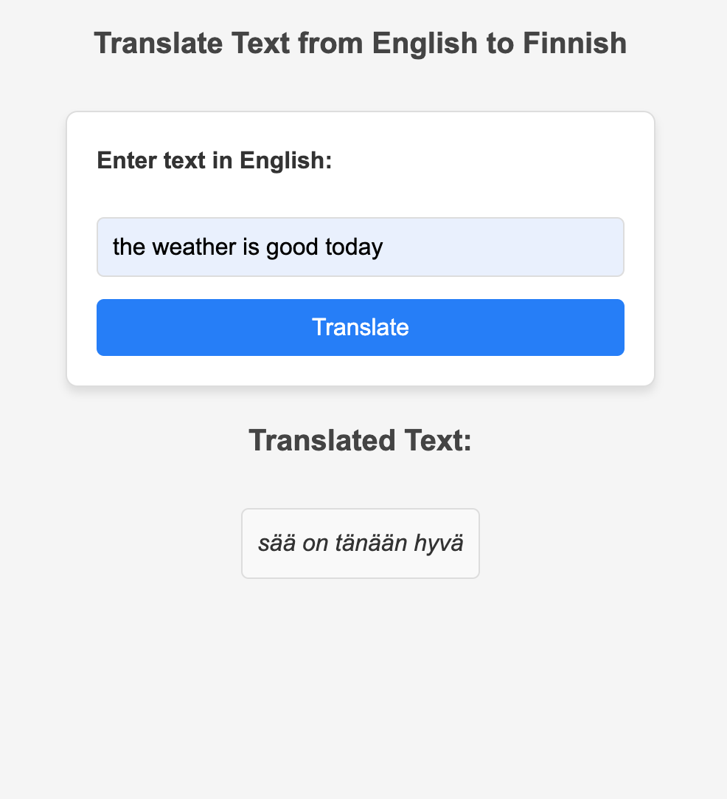
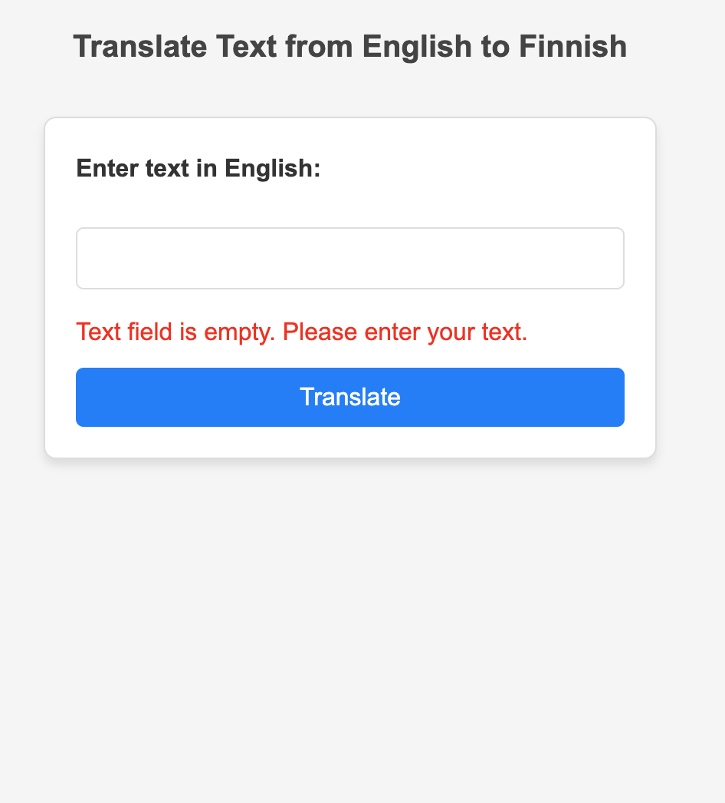

# Text Translator (English to Finnish)

A simple web-based text translator built using **Flask** and **Hugging Face Transformers**. The application translates English text into Finnish using the Helsinki-NLP/opus-mt-en-fi translation model. It features a user-friendly interface and dynamic error handling.

---

## ScreenShots

<p align="center">
  
  
  
</p>

---

## Features

- **Real-Time Translation**: Translates English text into Finnish using a pre-trained Hugging Face model.
- **Error Handling**:
  - Displays an error if the input text field is empty.
  - Handles server-side errors gracefully.
- **Interactive UI**:
  - Pressing "Enter" and clicking the "Translate" button work the same.
  - Errors and translated text are dynamically displayed.

---

## Requirements

- Python 3.9-3.12 (currently PyTorch version 2.2.2 supports only these Python versions)
- Flask
- Hugging Face Transformers
- Web browser

---

## Installation

1. **Clone the Repository**:
   ```bash
   git clone https://github.com/LVNDLORD/AI-Translator-Eng-Fin
   ```

2. **Install Dependencies**:
   ```bash
   pip install -r requirements.txt   # On Windows
   pip3 install -r requirements.txt  # On macOS/Linux
   ```

3. **Run the Application**:
   ```bash
   python app.py   # On Windows
   python3 app.py  # On macOS/Linux
   ```

4. Open the application in your browser at `http://127.0.0.1:5000`.

---

## File Structure

```
project/
├── static/
│   ├── styles.css
│   ├── js/
│   │   └── script.js  
|   ├── images/    
├── templates/
│   └── index.html
├── app.py
├── requirements.txt
└── README.md
```

---

## Usage

1. Enter a phrase in English in the input field.
2. Click the **Translate** button or press **Enter**.
3. View the translated text in Finnish below the button.
4. If the input field is empty, an error message will appear.

---

## Technologies Used

- **Frontend**:
  - HTML/CSS/JavaScript (Vanilla)
- **Backend**:
  - Flask
  - Hugging Face Transformers
- **Model**:
  - Helsinki-NLP/opus-mt-en-fi

---

## Customization

- To replace the translation model, update the following line in `app.py`:
  ```python
  pipe = pipeline("translation", model="Helsinki-NLP/opus-mt-en-fi")
  ```
  Replace `"Helsinki-NLP/opus-mt-en-fi"` with your desired Hugging Face model.

---

## Acknowledgments

- [Hugging Face Transformers](https://huggingface.co/)
- [Helsinki-NLP Translation Models](https://huggingface.co/Helsinki-NLP)
